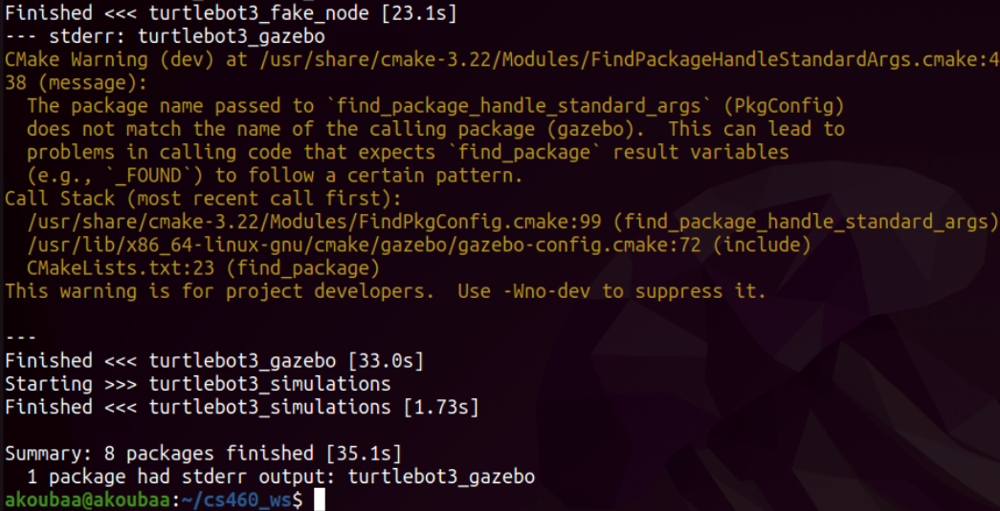
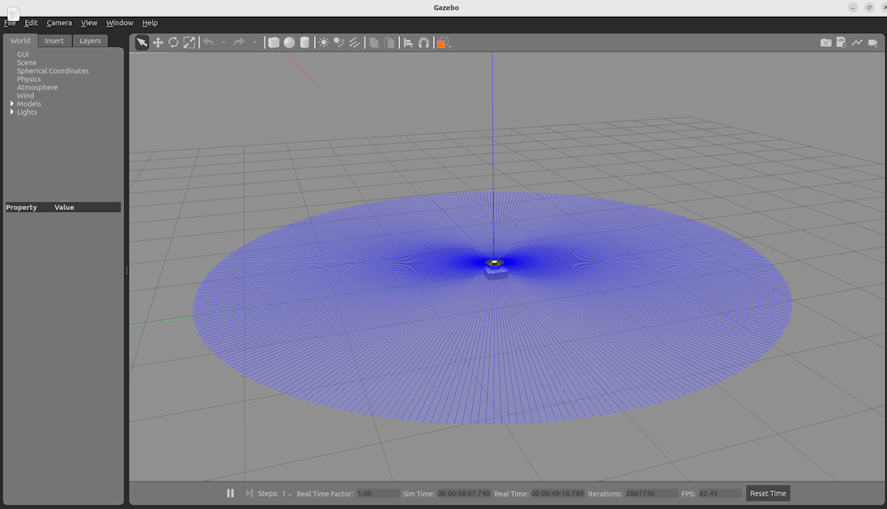
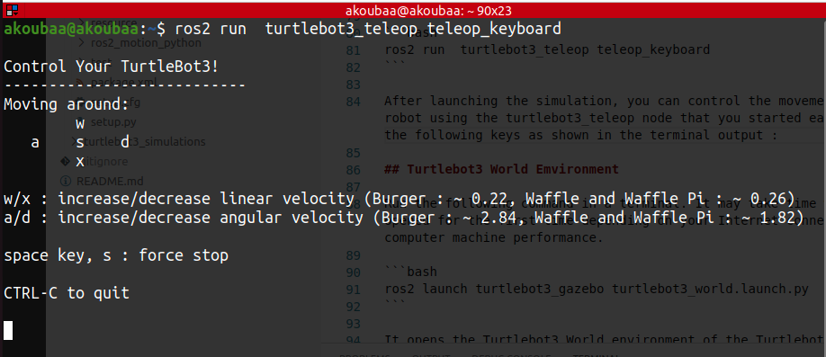
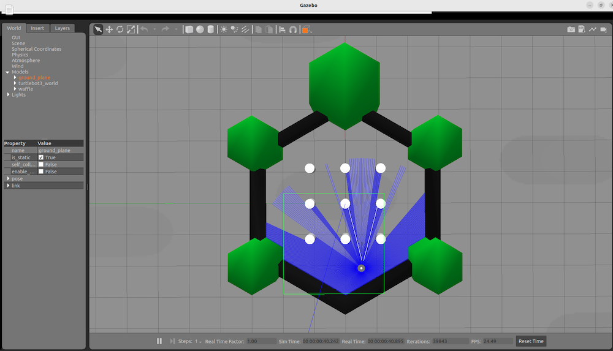
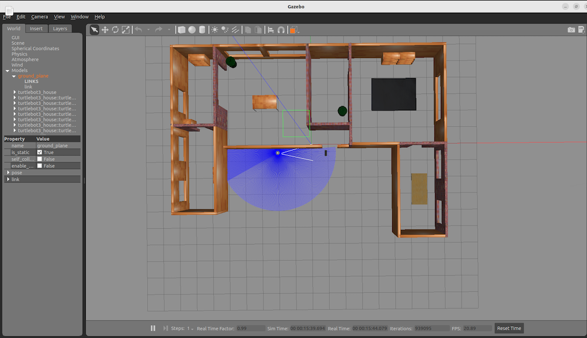
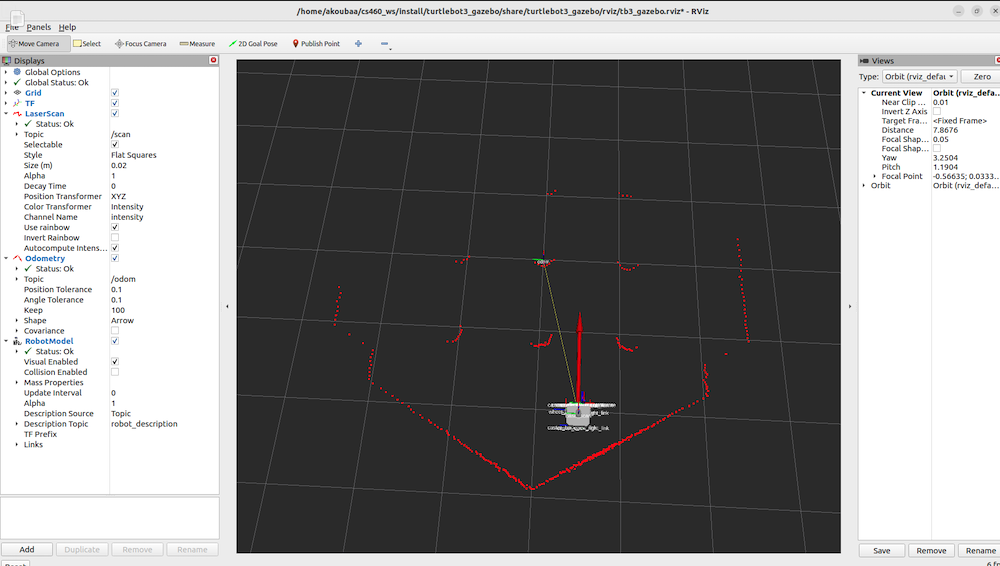

# ROS2 Humble and Turtlebot3 Installation Scripts
These scripts automate the installation of ROS2 Humble and Turtlebot3 in ROS2 Humble. The installation is done using one script that installs both packages.

# Prerequisites
These scripts are designed to run on Ubuntu. Before running the script, please make sure that:

* You have a Ubuntu machine 22.04 (Jammy) that meets the requirements for ROS2 Humble and Turtlebot3 Simulator

* You have internet access to download packages during the installation process

# Running the Scripts

* Download the `ros2_humble_install.sh` and `install-tb3.sh` files to your Ubuntu machine.

* Open the terminal and navigate to the directory where the files are downloaded.

Make the scripts executable using the following command:

```bash
chmod +x ros2_humble_install.sh install-tb3.sh
```
# ROS2 Installation 

### WARNING. ONLY IF ROS2 IS NOT INSTALLED

If ROS2 Humbe is installed on your machine, skip this section. 

If ROS2 Humble is not installed, run the ros2_humble_install.sh script as the root user using the following command:

```bash
sudo ./ros2_humble_install.sh
```

This script will install ROS2 Humble on your system.

# Turtlebot 3 Simulator Installation 

* Make sure that ROS2 Humble is properly installed on your Ubuntu 22.04 machine. 
* Go to the folder where `install-tb3.sh` script is located
* run the `install-tb3.sh` script using the following command:

```bash
./install-tb3.sh
```

**Note:** The installation process may take some time depending on your internet connection speed and the resources of your machine.

This script will install Turtlebot3 in ROS2 Humble.

## Possible Warning

The installation of Turtlebot3 simulator package may result in this developers' warning:



This is a CMake warning message related to the package configuration of Gazebo and PkgConfig. It indicates that the name of the package passed to find_package_handle_standard_args does not match the name of the calling package, which could cause issues with the find_package result variables.

The warning suggests that this issue is for project developers to address. If you are a developer and do not want to see this warning, you can use the -Wno-dev option to suppress it. However, it is generally recommended to address warnings like this to ensure the smooth functioning of your code.

If may be safe for users to ignore this warning message. 

# Test Turtlebot3 Installation 

This document provides instructions for testing Turtlebot3 Gazebo simulations using ROS2 launch commands. These commands require a ROS2 installation and assume that you have already installed the Turtlebot3 package.

## Turtlebot3 Empty Emvironment 

Run the following command in a terminal. It may take time when opened for the first time depending on your Internet connection and computer machine performance. 

```bash
ros2 launch turtlebot3_gazebo empty_world.launch.py
```

It opens the empty world environment of the Turtlebot3 simulator, as follows. 



You can test teleoperating the Turtlebot3 robot using the command:

```bash
ros2 run  turtlebot3_teleop teleop_keyboard
```

After launching the simulation, you can control the movement of the robot using the turtlebot3_teleop node that you started earlier. Use the following keys as shown in the terminal output :



## Turtlebot3 World Emvironment 

Run the following command in a terminal. It may take time when opened for the first time depending on your Internet connection and computer machine performance. 

```bash
ros2 launch turtlebot3_gazebo turtlebot3_world.launch.py
```

It opens the Turtlebot3 World environment of the Turtlebot3 simulator, as follows. 



After launching the simulation, you can control the movement of the robot using the turtlebot3_teleop node that you started earlier.

## Turtlebot3 House Emvironment 

TB3 house is a simulated indoor environment for Turtlebot3 Gazebo simulations. It features a one floor house with multiple rooms, stairs, and obstacles, providing a realistic environment for testing and debugging Turtlebot3 applications. The TB3 house environment is useful for developing and testing indoor navigation, mapping, and object detection algorithms.

Run the following command in a terminal. It may take time when opened for the first time depending on your Internet connection and computer machine performance. 

```bash
ros2 launch turtlebot3_gazebo turtlebot3_world.launch.py
```

It opens the Turtlebot3 World environment of the Turtlebot3 simulator, as follows. 



After launching the simulation, you can control the movement of the robot using the turtlebot3_teleop node that you started earlier.

## Visualize with RVIZ

To test the Turtlebot3 Gazebo simulations, follow the instructions below:

* Launch one turtlebot3 environment, for example with the command: 
```
ros2 launch turtlebot3_gazebo empty_world.launch.py
```
* Run the Turtlebot3 teleop node to control the robot using the keyboard: 
```
ros2 run turtlebot3_teleop teleop_keyboard
```
* Launch rviz2 with the Turtlebot3 configuration file: 
```
ros2 launch turtlebot3_fake_node rviz2.launch.py
```

* The `rviz2.launch.py` command launches the RViz visualization tool with a pre-configured setup for Turtlebot3.  It will show as follow. 



RViz allows you to view sensor data from the simulated robot, such as laser scans and camera images, and visualize the robot's current state and trajectory. This can be useful for debugging and testing robot applications.

# Troubleshooting
If you encounter any issues during the installation process, please refer to the respective documentation for ROS2 and Turtlebot3 or seek assistance from the community.

# Maintainers
This repository is maintained by Prof. Anis Koubaa. If you have any questions or suggestions, please feel free to contact us.

# Contributing
If you find any issues with the packages or would like to contribute, please create a new issue or pull request on the GitHub repository.

# License
This project is licensed under Creative Commons Attribution-NonCommercial-ShareAlike 4.0 International License.